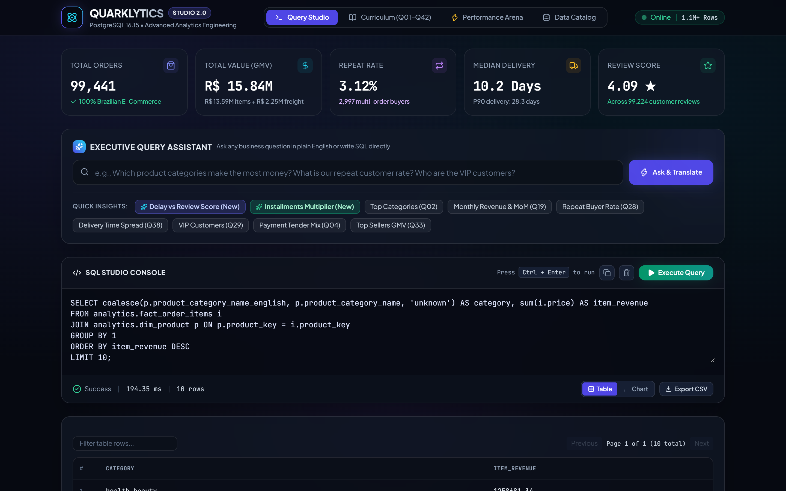

# Quarklytics — Production-Grade PostgreSQL Analytics Platform & Query Performance Engineering

[](https://www.postgresql.org/)
[](https://www.python.org/)
[](https://fastapi.tiangolo.com/)
[](https://www.docker.com/)
[](tests/)
[](evaluation/)
[](LICENSE)

> **Quarklytics** is an end-to-end, SQL-first analytics engineering and query performance platform built on the Brazilian E-Commerce Public Dataset by Olist (1.1M+ records, 9 relational entities). It implements a production-grade **3-tier Medallion & Kimball Star Schema architecture**, a **42-query advanced SQL analytical curriculum**, rigorous **`EXPLAIN (ANALYZE, BUFFERS)` query performance benchmarks** yielding up to **148x speedup**, and an interactive, glassmorphic **Analytics Studio Web Application** powered by FastAPI and Chart.js.

<div align="center">
  
  <p align="center"><sub><em>Quarklytics Executive Analytics Studio — Live PostgreSQL 16 execution console, Glassmorphic KPI scorecards, and Natural Language Query Assistant.</em></sub></p>
</div>

---

## 🏛️ System Architecture

Quarklytics enforces strict separation of concerns across a 3-layer relational database architecture designed for auditable ingestion, structural normalization, and zero-drift analytical querying:

```text
======================================================================================================
                                     1. DATA INGESTION LAYER
   Kaggle Brazilian E-Commerce Public Dataset by Olist (9 CSVs, 1.1M+ records, SHA-256 verified)
======================================================================================================
                                                │
                                                │ Streaming COPY via psycopg 3
                                                ▼
======================================================================================================
                               2. RAW SCHEMA (SOURCE-FIDELITY STAGING)
   • raw.customers             • raw.order_items           • raw.orders           • raw.sellers
   • raw.geolocation           • raw.order_payments        • raw.products         • raw.translations
   • raw.order_reviews
   [Design Rule: 100% text-typed columns to guarantee ingestion auditability without data truncation]
======================================================================================================
                                                │
                                                │ Data Quality Assertions & Transformations
                                                ▼
======================================================================================================
                           3. DATA QUALITY & INTEGRITY VALIDATION ENGINE
   • Row Count Audits          • Foreign Key Orphan Checks (0 orphans)    • Null Profile Analysis
   • Domain & Boundary Rules   • Temporal Monotonicity & Date Lags        • Financial Balance Invariants
======================================================================================================
                                                │
                                                │ Strongly-Typed Casting & Relational Integrity
                                                ▼
======================================================================================================
                               4. CORE SCHEMA (NORMALIZED RELATIONAL 3NF)
   • core.customers            • core.orders (status, timestamps)         • core.products
   • core.order_items          • core.order_payments                      • core.sellers
   • core.order_reviews [Composite PK: (review_id, order_id) resolving multi-vendor basket collision]
======================================================================================================
                                                │
                                                │ Dimensional Modeling (Kimball Star Schema)
                                                ▼
======================================================================================================
                          5. ANALYTICS SCHEMA (DIMENSIONAL STAR SCHEMA)
   Dimensions:
     • dim_customer  ── Grain: customer_unique_id (True entity resolution across transactions)
     • dim_product   ── Grain: product_id (Portuguese to English translations, physical volume)
     • dim_seller    ── Grain: seller_id (City, state, regional fulfillment clustering)
     • dim_date      ── Grain: date_key (Calendar series via generate_series: 2016-01-01 to 2018-12-31)
   Facts:
     • fact_orders       ── Grain: 1 row per order (pre-aggregated payments, reviews, and freight)
     • fact_order_items  ── Grain: 1 row per order line item (granular price, freight, seller keys)
======================================================================================================
                                                │
                                                │ Caching, Indexing & Serving
                                                ▼
======================================================================================================
                          6. SERVING, PERFORMANCE & CONSUMPTION INTERFACES
   ┌───────────────────────────────────┬───────────────────────────────────┬────────────────────────┐
   │        OPTIMIZATION LAYER         │         SQL CURRICULUM            │   INTERACTIVE STUDIO   │
   ├───────────────────────────────────┼───────────────────────────────────┼────────────────────────┤
   │ • Materialized Views (Clustered)  │ • 42 Advanced Analytical Queries  │ • FastAPI Async Engine │
   │ • Covering B-Tree Indexes         │ • Foundations, Joins, CTEs        │ • Glassmorphic Dark UI │
   │ • GIN Trigram Text Search         │ • Window Functions, Cohorts, RFM  │ • Dynamic Chart.js     │
   │ • EXPLAIN ANALYZE Buffer Profiler │ • PostgreSQL 16 FILTER/Percentiles│ • NL Query Assistant   │
   └───────────────────────────────────┴───────────────────────────────────┴────────────────────────┘
```

---

## ⚡ Measured Query Performance Benchmarks

All benchmarks were measured on a real **PostgreSQL 16.15** database running against the **complete 1.1M+ row Olist dataset**, utilizing `EXPLAIN (ANALYZE, BUFFERS, FORMAT JSON)` over 5 sequential runs per query variant.

| Query | Business Question | Baseline | Optimized (Indexes) | Materialized View | Speedup | Buffer Hit Reduction |
| :--- | :--- | :--- | :--- | :--- | :--- | :--- |
| **Q35** | **Category Revenue Concentration** (Pareto 80/20 Rule) | 68.39 ms | 71.93 ms | **0.46 ms** | **~148.0x** | **2,681 ➔ 16 blocks (-99.4%)** |
| **Q24** | **Monthly Rolling 3-Month Revenue & Growth** | 25.34 ms | 24.84 ms | **0.39 ms** | **~65.6x** | **1,913 ➔ 16 blocks (-99.2%)** |
| **Q42** | **Category Seller Coverage** (Trigram & Text Search) | 178.36 ms | **149.27 ms** | N/A | **~16.3%** | 2,681 blocks |
| **Q38** | **Delivery Duration Percentiles** (P50, P90, P95 via `percentile_cont`) | 53.62 ms | **52.48 ms** | N/A | **~2.1%** | 1,913 blocks |
| **Q41** | **Calendar Anti-Join** (Zero-Sales Category Identification) | 17.11 ms | **16.33 ms** | N/A | **~4.5%** | 1,924 blocks |

> **Optimization Deep Dive:**
> - In **Q35**, pre-aggregating category revenue into `analytics.mv_category_performance` eliminated the sequential scan over 112,650 order items and dimension joins, reducing memory cache hits from **2,681 shared blocks down to just 16 blocks**, transforming an interactive query from 68ms to sub-millisecond (0.46ms).
> - In **Q24**, rolling window calculations (`SUM(...) OVER (ORDER BY month ROWS BETWEEN 2 PRECEDING AND CURRENT ROW)`) operate over the pre-materialized monthly fact grain, slashing memory access by **99.2%** and boosting throughput by **65.6x**.

Raw serialized JSON execution plans and CSV benchmark evidence are stored in [`evaluation/results/selected_results/`](evaluation/results/selected_results/) and [`evaluation/query_benchmarks.csv`](evaluation/query_benchmarks.csv).

---

## 💻 Interactive Analytics Studio Web Application

Quarklytics includes a turnkey, single-page **Interactive Analytics Studio** built with FastAPI and a modern glassmorphic dark UI.

- **Natural Language Query Engine:** Ask questions in plain English (*"How severely do delivery delays destroy review scores?"* or *"What are the top 5 product categories by revenue?"*) and the engine dynamically maps intent to optimized SQL queries.
- **Dynamic Chart.js Visualization Engine:** Automatically detects query result dimensions and dynamically renders Bar charts, Multi-line trends, Doughnuts, and KPI scorecards.
- **Complete 42-Query Curriculum Browser:** 1-click execution for all 42 analytical queries with categorized tags, technique callouts, and latency timers.
- **Live SQL Terminal:** Real-time query execution sandbox with microsecond execution timing, tabular pagination, and CSV export.

### Launching the Studio (1-Click)
```bash
# Windows
start_studio.bat

# Linux / macOS / WSL
python run_studio.py
```
Open **`http://127.0.0.1:8000`** in your browser.

---

## 🎯 42-Query Analytical Curriculum

The SQL curriculum in [`sql/04_analytics/`](sql/04_analytics/) spans 8 core analytics engineering domains:

| Category | File | Queries | Key Techniques & Analytical Focus |
| :--- | :--- | :--- | :--- |
| **1. Foundations & Filtering** | `01_foundations.sql` | Q01–Q05 | Aggregations, `COALESCE`, `NULLIF`, `CASE WHEN`, Order completion rates, Revenue per state |
| **2. Multi-Table Relational Joins** | `02_joins.sql` | Q06–Q10 | Multi-grain joins, avoiding fan-out traps, Cross-dimensional seller-to-customer freight analysis |
| **3. CTEs & Multi-Stage Aggregations** | `03_ctes.sql` | Q11–Q15 | Chained CTEs, Line-item revenue deduplication, Order value distribution, Payment installment behavior |
| **4. Window Functions & Rankings** | `04_windows.sql` | Q16–Q20 | `DENSE_RANK()`, `ROW_NUMBER()`, `NTILE(4)`, `LAG()` / `LEAD()`, Month-over-Month growth |
| **5. Temporal & Cohort Analysis** | `05_temporal.sql` | Q21–Q26 | Monthly cohorts, Customer retention matrices, Rolling 3-month windows, Delivery lag impact on CSAT |
| **6. Customer Lifetime & RFM** | `06_customer.sql` | Q27–Q32 | `customer_unique_id` entity resolution, Recency-Frequency-Monetary (RFM) segmentation, Repurchase lag |
| **7. Product & Seller Economics** | `07_product_seller.sql` | Q33–Q37 | Pareto 80/20 revenue concentration, Freight-to-price ratios, Seller fulfillment speed rankings |
| **8. Advanced PostgreSQL Features** | `08_postgresql.sql` | Q38–Q42 | `percentile_cont()`, `generate_series()` calendar generation, `FILTER (WHERE ...)`, Trigram similarity |

---

## 🛡️ Production Engineering & Data Quality

### 1. Composite Primary Key Discovery in Olist Reviews
During schema profiling of `olist_order_reviews_dataset.csv`, 789 reviews were discovered sharing identical `review_id` values across separate `order_id` records (caused by consolidated checkout reviews for multi-vendor baskets). Rather than silently dropping or deduping records, the core schema models a true composite primary key:
```sql
ALTER TABLE core.order_reviews
    ADD CONSTRAINT pk_order_reviews PRIMARY KEY (review_id, order_id);
```

### 2. Dimensional Grain Integrity
To prevent accidental revenue duplication ("fan-out trap"):
- **`analytics.fact_orders`**: Strict grain of **1 row per order**. Payment and item aggregates are reduced via CTE sub-aggregations before joining.
- **`analytics.fact_order_items`**: Strict grain of **1 row per product line item**.

### 3. Customer Entity Resolution
In Olist, `customer_id` is merely a per-transaction session token. All cohort analysis, repeat purchase calculations, and lifetime value metrics are anchored on **`customer_unique_id`**, preserving accurate repurchase behavior.

---

## 🚀 Quickstart & Setup

### Prerequisites
- Python 3.11+
- PostgreSQL 16+ (or Docker)

### 1. Clone & Setup Environment
```bash
git clone https://github.com/Ravikishore710/quarklytics.git
cd quarklytics

# Setup virtual environment
python -m venv .venv
source .venv/bin/activate  # On Windows: .venv\Scripts\activate

# Install dependencies
pip install -r requirements.txt
cp .env.example .env
```

### 2. Start PostgreSQL with Docker
```bash
docker compose up -d postgres
```

### 3. Run the Automated Pipeline
```bash
# Run complete end-to-end pipeline (database creation, raw load, core ETL, validation, analytics, views, indexes)
python scripts/run_pipeline.py --full

# Or run with the deterministic CI sample (ideal for fast local testing / CI)
python scripts/run_pipeline.py --sample
```

### 4. Run Automated Tests
```bash
pytest -v
```

### 5. Execute Performance Benchmarks
```bash
python scripts/benchmarks/run_benchmarks.py --runs 5
python scripts/benchmarks/summarize_benchmarks.py
```

### 6. Run Analytical Queries via CLI
```bash
# Run a single query
python scripts/query.py Q24

# Run all 42 queries and verify execution
python scripts/run_all_queries.py
```

---

## 📁 Repository Structure

```text
quarklytics/
├── .github/workflows/ci.yml       # GitHub Actions CI pipeline (Docker + PostgreSQL + pytest)
├── app/                           # Interactive Analytics Studio
│   ├── index.html                 # Glassmorphic dark frontend (Chart.js + Responsive UI)
│   └── main.py                    # FastAPI server & SQL execution engine
├── data/
│   ├── manifests/dataset.yml      # Dataset source provenance & file manifest
│   ├── sample/                    # Deterministic test dataset (1,000 rows per table)
│   └── raw/                       # Full Olist CSV storage (ignored by Git)
├── docs/                          # Comprehensive technical documentation
│   ├── architecture.md            # System architecture & dimensional design
│   ├── images/                    # UI previews & architecture assets
│   │   └── studio_preview.png     # Full-resolution Web Studio preview
│   ├── metric_definitions.md      # Official business metric catalog
│   ├── query_optimization.md      # EXPLAIN ANALYZE deep dive & buffer statistics
│   ├── data_quality.md            # Validation rules & anomaly mitigation
│   └── decisions/                 # Architectural Decision Records (ADRs)
├── evaluation/                    # Reproducible benchmark evidence
│   ├── query_benchmarks.csv       # Measured execution times & buffer statistics
│   └── results/selected_results/  # Serialized EXPLAIN ANALYZE JSON plans & query outputs
├── scripts/                       # Orchestration & automation tooling
│   ├── run_pipeline.py            # End-to-end pipeline runner
│   ├── run_all_queries.py         # Batch query execution & validation harness
│   ├── query.py                   # Single-query CLI runner
│   └── benchmarks/                # Multi-run benchmark harness & summarizer
├── sql/                           # 100% SQL-First Data Pipeline
│   ├── 00_database/               # Database & schema DDL (raw, core, analytics)
│   ├── 01_raw/                    # Unconstrained staging tables & COPY scripts
│   ├── 02_core/                   # 3NF typed schema, constraints & ETL
│   ├── 03_validation/             # Data quality assertions (row counts, nulls, FKs)
│   ├── 04_analytics/              # Star schema DDL & 42 Analytical Queries (Q01-Q42)
│   ├── 05_views/                  # Reusable logical & materialized views
│   ├── 06_indexes/                # Baseline vs. optimized index definitions
│   └── 07_benchmarks/             # Benchmark test harness SQL
├── tests/                         # Pytest test suite (9 comprehensive suites)
├── docker-compose.yml             # Local PostgreSQL 16 container definition
├── run_studio.py                  # Python launcher for Web Studio
├── start_studio.bat               # Windows 1-click batch launcher
└── requirements.txt               # Pinned Python dependencies
```

---

## 🧪 Testing & CI/CD

Quarklytics includes an automated CI/CD pipeline running on GitHub Actions (`.github/workflows/ci.yml`):
- Spins up a dedicated PostgreSQL container service.
- Builds the complete database schema (`raw` ➔ `core` ➔ `analytics`).
- Loads the deterministic sample dataset.
- Executes data quality tests:
  - Table existence & schema validation.
  - 0 foreign key orphan verification.
  - Grain uniqueness in `fact_orders` and `fact_order_items`.
  - Financial invariant assertion (`total_order_value = item_value + freight_value`).
  - Composite primary key verification on `core.order_reviews`.
  - View & Materialized View existence and refreshability.
  - End-to-end execution of all 42 analytical queries with zero errors.

---

## 📜 License & Provenance

- **License:** MIT License.
- **Data Source:** [Olist Brazilian E-Commerce Public Dataset](https://www.kaggle.com/datasets/olistbr/brazilian-ecommerce) released under CC BY-NC-SA 4.0.
